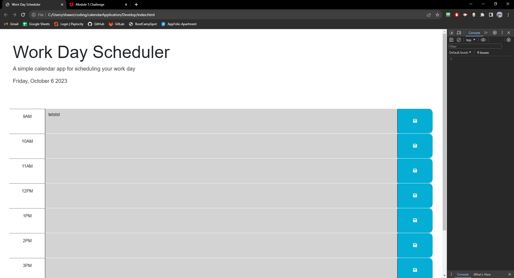

# Work Day Scheduler Starter Code

## Description
This is a webpage that allows you to create tabs where it will save the tasks you have to do for a given hour of the day. Currently it is all the hours from 9am to 5pm. Any text you put into the text field, will be saved for into localStorage when clicking the save button. It will persist even when the page has been refreshed

## Table of Contents
This is probably too short of a README to require a Table of Contents...

## Installation
No installation required! N/A

## Usage
Visit the following link :

https://shawncrook411.github.io/calendarApplication

The actual repo can be found here :

https://github.com/shawncrook411/calendarApplication

## Screenshots
Here's a screenshot of the screen

## Contributions

Original source code provided from bootCampSpot
